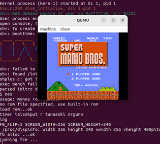
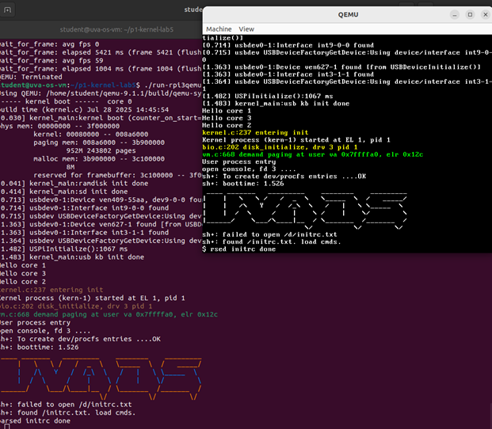
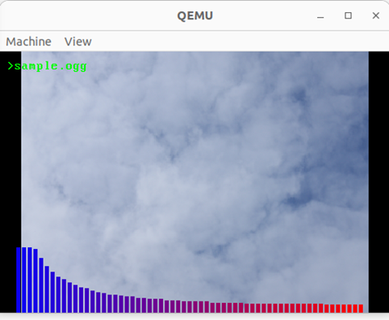
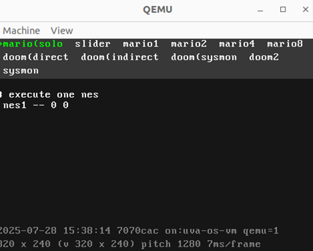
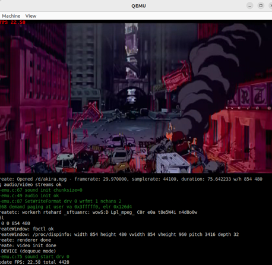
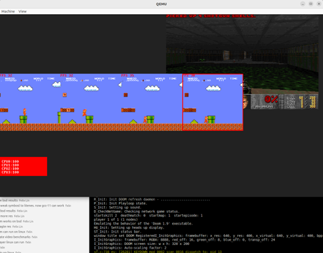

# 1. QEMU (emulator)

We provide:

- VMWare installation package for Windows (`VMware-workstation-full-17.5.2-23775571.exe`)
- The VM image file for Windows

How to Run a Provided VM Image on Windows

https://github.com/fxlin/uva-os-main/blob/main/docs/vm/vmware.md

## VM credentials
user:student

password:uvaos

## 1.1 Donut

### 1.1.1 Textual Donut

**How to run pre-built binaries:**
```sh
cd ~/p1-kernel-lab1
KERNEL=kernel-artifacts/kernel8-rpi3qemu-donuttext.img ./run-rpi3qemu.sh
```

**How to build from source:**
```sh
cd ~/p1-kernel-lab1
# In kernel/kernel.c, function kernel_main(), uncomment the function call to donut_text()
export PLAT=rpi3qemu
./cleanall.sh
./makeall.sh
./run-rpi3qemu.sh
```

### 1.1.2 Pixel Donut

**How to run pre-built binaries:**
```sh
cd ~/p1-kernel-lab1
KERNEL=kernel-artifacts/kernel8-rpi3qemu-donutpixel.img ./run-rpi3qemu.sh
```

**How to build from source:**

```sh
cd ~/p1-kernel-lab1
# In kernel/kernel.c, function kernel_main(), uncomment the function call to donut()
export PLAT=rpi3qemu
./cleanall.sh
./makeall.sh
./run-rpi3qemu.sh
```

### 1.1.3 N donuts
**How to run pre-built binaries:**
```sh
cd ~/p1-kernel-lab2
KERNEL=kernel-artifacts/kernel8-rpi3qemu-Ndonuts.img ./run-rpi3qemu.sh
```
**How to build from source:**
```sh
cd ~/p1-kernel-lab2
export PLAT=rpi3qemu
./cleanall.sh
./makeall.sh
./run-rpi3qemu.sh
```

## 1.2 Mario

### 1.2.1 Mario w/o input:

**How to run pre-built binaries:**
```sh
cd ~/p1-kernel-lab3
KERNEL=kernel-artifacts/kernel8-rpi3qemu-mario-noinput.img ./run-rpi3qemu.sh
```

**How to build from source:**
```sh
cd ~/p1-kernel-lab3
export PLAT=rpi3qemu
./cleanall.sh
./makeall.sh
./run-rpi3qemu.sh
```

### 1.2.2 Mario With input:
**How to run pre-built binaries:**
```sh
cd ~/p1-kernel-lab5
KERNEL=kernel-artifacts/kernel8-rpi3qemu-console.img ./run-rpi3qemu.sh
# boot, then type `nes` on the shell (UART input)
```



**How to build from source:**
```sh
cd ~/p1-kernel-lab5
# backup the old initrc
mv usr/initrc.txt "usr/initrc-$(date +%Y%m%d-%H%M%S).txt"
# create an empty one
touch usr/initrc.txt
export PLAT=rpi3qemu
./cleanall.sh
./makeall.sh
./run-rpi3qemu.sh
```

## 1.3 Sysmon

```sh
cd ~/p1-kernel-lab5
KERNEL=kernel-artifacts/kernel8-rpi3qemu-console.img ./run-rpi3qemu.sh
# boot, then type `sysmon` on the shell (UART input)
```

## 1.4 Shell & Utilities

### 1.4.1 Text-based shell:

See [1.2.2 Mario With input](#122-mario-with-input)

### 1.4.2 Framebuffer-based shell:



**How to run pre-built binaries:**

```sh
cd ~/p1-kernel-lab5
KERNEL=kernel-artifacts/kernel8-rpi3qemu-consolefb.img ./run-rpi3qemu.sh
```
**How to build from source:**

See [1.2.2 Mario With input](#122-mario-with-input). Before compiling: 

- From the code, uncomment `KCONSOLE_PRINTF` (kernel/param.h).
- (Optional): for QEMU, one may enlarge the initial framebuffer so the console has a larger size.
	- Go to `fb_struct the_fb` (in kernel/mbox.c), uncomment larger initial fb sizes (width/height/vwidth/vheight) for QEMU build (`PLAT_RPI3QEMU`). No need to change for rpi3 build.

## 1.5 Slider

**How to run pre-built binaries** See [1.2.2 Mario With input](#122-mario-with-input)
- Boot, then type `slider` on the shell (UART input)

**How to build from source:**
See [1.2.2 Mario With input](#122-mario-with-input).

## 1.6 Buzzer

unsupported for QEMU, which lacks emulation for sound hardware.
    
## 1.7 Music Player



**How to run pre-built binaries** See [1.2.2 Mario With input](#122-mario-with-input)
- Boot, then type `mplayer /d/` on the shell (UART input)

Note: on QEMU, this app only renders visual effect. No sound output is available due to lack of sound hardware emulation.

**How to build from source:**

See [1.2.2 Mario With input](#122-mario-with-input).

## 1.8 DOOM

**How to run pre-built binaries** 

See [1.2.2 Mario With input](#122-mario-with-input)
- Boot, then type `doom -playdemo demo1` on the shell (UART input)

**How to build from source:**

See [1.2.2 Mario With input](#122-mario-with-input).

## 1.9 Menu


**How to run pre-built binaries** See [1.2.2 Mario With input](#122-mario-with-input)
- Boot, then type `menu` on the shell (UART input)

**How to build from source:**

See [1.2.2 Mario With input](#122-mario-with-input).

## 1.10 Blockchain

**How to run pre-built binaries** See [1.2.2 Mario With input](#122-mario-with-input)
- Boot, then type `blockchain 4` on the shell (UART input)

**How to build from source:**

See [1.2.2 Mario With input](#122-mario-with-input).

## 1.11 Video Player



**How to run pre-built binaries** See [1.2.2 Mario With input](#122-mario-with-input)
- Boot, then type `mpg /d/akira.mpg --preload` on the shell (UART input)

**How to build from source:**
See [1.2.2 Mario With input](#122-mario-with-input).

## 1.12 Desktop



**How to run pre-built binaries:**
```sh
cd ~/p1-kernel-lab5
KERNEL=kernel-artifacts/kernel8-rpi3qemu-desktop.img ./run-rpi3qemu.sh
```

**How to build from source:** 

```sh
cd ~/p1-kernel-lab5
mv usr/initrc.txt "usr/initrc-$(date +%Y%m%d-%H%M%S).txt"
cp usr/initrc-demo.txt usr/initrc.txt
export PLAT=rpi3qemu
./cleanall.sh
./makeall.sh
./run-rpi3qemu.sh
```

## 1.13 8 Marios

**How to run pre-built binaries:**
```sh
cd ~/p1-kernel-lab5
KERNEL=kernel-artifacts/kernel8-rpi3qemu-8Marios.img ./run-rpi3qemu.sh
```

**A known bug:** On QEMU and a slow(er) host machine, kernel may hang occasionally. This is a known bug due to emulated USB driver timeout. Retry the command if that happens.

**How to build from source:**
```sh
cd ~/p1-kernel-lab5
mv usr/initrc.txt "usr/initrc-$(date +%Y%m%d-%H%M%S).txt"
cp usr/initrc-8nes-asap-quiet.txt usr/initrc.txt
export PLAT=rpi3qemu
./cleanall.sh
./makeall.sh
./run-rpi3qemu.sh
```
