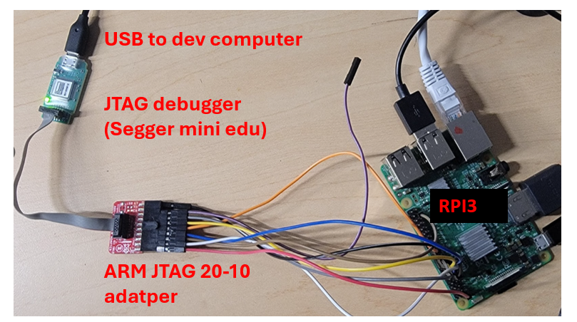
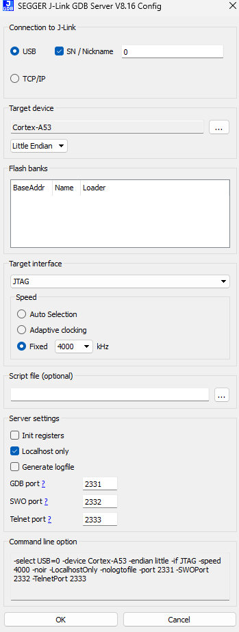
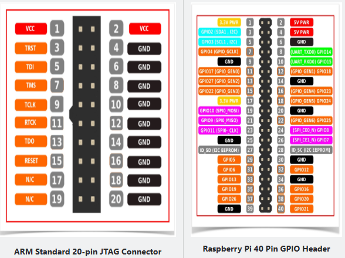
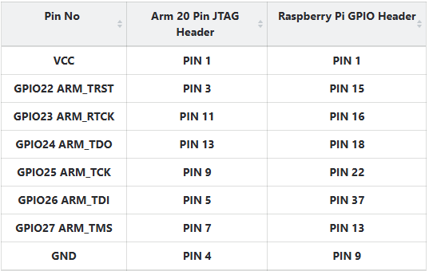
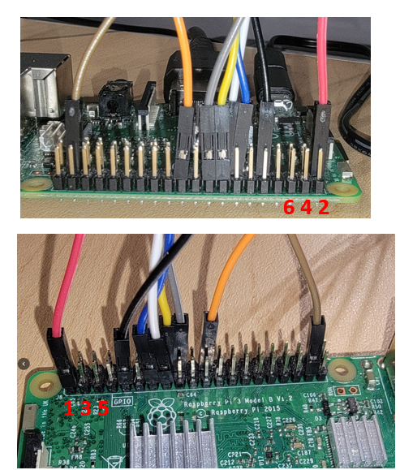
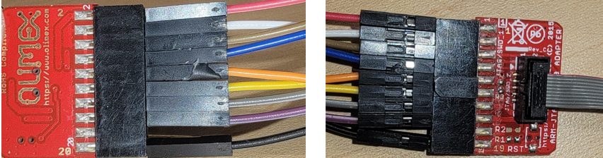
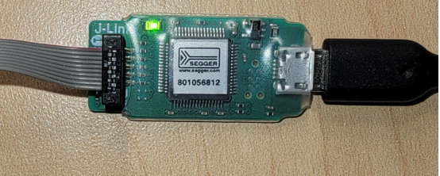

# JTAG debugging 101

Mar 2025, 2025



*Picture above: A JTAG debugger, among other things, connected to an Rpi3 board (see below for connection details)* 

## Overview

JTAG is a specialized hardware interface that allows for in-situ debugging of a target board. It enables the observation of registers, setting of breakpoints, and monitoring of memory contents, providing an interactive debugging experience similar to that of QEMU (at least that's the goal).

**Verdict**: JTAG debugging should not be considered a replacement for self-hosted debugging. It is more suitable for debugging bare-metal or embedded systems, or the early boot stages of an OS kernel.

For rpi3 -- 

[V] breakpoint & single step in kernel code

[V] attach to a running core & show registers, call stack, etc. (e.g. for debugging hang, deadlock) 

[?] breakpoint & single step in user code (can be done, but tedious. see below)

[X] reset target and halt (no luck)

[X] load program to target (no luck)

[X] read system registers (no luck)


### Comparison

#### JTAG Debugging

- **JTAG debugging**: Using a JTAG debugger to attach to a target processor (e.g., BCM2835 on Raspberry Pi 3). The JTAG debugger serves as a bridge between the development machine and the target processor, communicating debugging commands (read/write of memory, registers, etc.).

- **Pros**: 
    - Interactive
    - Can easily watch lots of information
    - Less code to write
- **Cons**: 
    - Requires effort to set up (both hardware wiring and software tools)
    - Debugging connection can be brittle and break occasionally
    - Slower execution and single stepping

#### Self-Hosting Debugging

- **Self-hosting debugging**: Without an external debugger, the target system implements software debugging logic as part of the OS. This includes `printf` via UART, a trace buffer, and hardware breakpoints/watchpoints as supported by the processor.

- **Pros**: 
    - Mostly about collecting information (either in real-time such as UART messages, or post-mortem such as kernel event trace and CPU instruction trace) and analyzing it
    - Less setup required
- **Cons**: 
    - More debugging code to write, which may introduce new bugs (e.g., deadlock in trace buffer)

## Status -- jtag debugging for rpi3

As of February 2025, there are two possible solutions:

### Solution 1: FTDI-based JTAG Debugger

- **Cost**: Under $50
- **Hardware**: FT2232H chip, a USB-to-JTAG bridge
- **Software**: OpenOCD, which supports a variety of target boards, including Raspberry Pi 3 and 4. OpenOCD can run on Linux (including in a VM), WSL2 (through USB device passthrough), and natively on Windows.

**Pros**:
- Affordable
- Wide support for different target boards

**Cons**:
- OpenOCD implements only basic debugging commands.
- Breakpoints are set by overwriting instructions in memory instead of using hardware breakpoints.
- Execution with conditional breakpoints is slow.
- Cannot reset the target board to 'halt'; must attach the debugger while the target is in a waiting state.
- Cannot read/write system registers, including debugging registers like DBGBCR0_EL1.

### Solution 2: Segger J-Link Debugger

- **Cost**: Educational version at $60, full version $500 or more
- **Software**: More advanced than OpenOCD but lacks official support for Raspberry Pi boards.

**Pros**:
- More advanced software tools

**Cons**:
- Expensive
- No official support for Raspberry Pi boards, leading to issues like "Error: CTI connected to core not found. Debugging not possible."
- More focused on microcontroller boards.

References:
- [Stack Overflow discussion](https://stackoverflow.com/questions/58480411/j-link-connection-to-cortex-a53-raspberry-pi3b)
- [Segger forum discussion](https://forum.segger.com/index.php/Thread/9280-SOLVED-Ask-again-for-Raspberry-Pi-connect/)




Therefore, despite J-Link's rich software support, the only solution to use it with Raspberry Pi 3 is OpenOCD, which suffers from all the drawbacks mentioned above.

## SetupHowto

### hardware wiring 

#### Overview 


NB: purple wire not connected.

#### Diagram [source](https://linaro.atlassian.net/wiki/spaces/TCWGPUB/pages/25296346120/Raspberry+Pi+Linux+kernel+debugging+with+OpenOCD)





#### rpi3-side connections




#### the 20-10 adapter



#### the JTAG debugger 




### the rpi3 config.txt 

add the following lines: 
```
enable_jtag_gpio=1
gpio=23-27=a4
gpio=22=a4,pu
```
The idea is to put the gpios used for JTAG connection for "alternate function 4". gpio22 is special, which connects to the jtag TRST signal. It must be pulled up.
[discussion](https://forums.raspberrypi.com/viewtopic.php?t=286115)

### OpenOCD Commands

You need two configuration files: one for the target (Raspberry Pi 3) and one for the debugger (J-Link).

The configuration files included with the OpenOCD package work fine.

Here is an example `run.bat` file that launches the OpenOCD GDB server. Place this file in the OpenOCD directory:

```
@echo off
cd /d "%~dp0"
bin\openocd.exe -f share/openocd/scripts/interface/jlink.cfg -f share/openocd/scripts/board/rpi3.cfg -c "bindto 172.26.96.1"
REM bin\openocd.exe -f share/openocd/scripts/interface/jlink.cfg -f rpi3.cfg -c "bindto 172.26.96.1"
pause
```

In the example above, the server listens at `172.26.96.1`, which is the Windows machine's IP address with respect to the WSL2 VM. This allows GDB to connect from WSL2.

**Caveats**:
It is better to kill and restart OpenOCD every time the target board is reset; otherwise, GDB may show stale values (e.g., old PC from a previous run or all zeros for instructions and memory).

#### Workflow

1. Kill `openocd`.
2. Kill `gdb`.
3. Reset the target board.
4. Start `openocd`. This will attach to the running target and halt it at the current instruction.
5. Start `gdb`.

Due to step 4, the target code (OS) should be designed to wait for the debugger to attach. Otherwise, you won't have control over which code is being executed when the debugger attaches. This can be achieved by adding code to the OS that waits for a character from UART.

**Question**: How to attach JTAG during the boot.S code?
**Answer**: I use an infinite loop to wait for attachment and then change the loop condition from the JTAG to continue the boot process.

#### Setting Breakpoints

When attaching to the target, it runs the kernel code at EL1. Suppose GDB has already loaded the kernel ELF (`file kernel8.elf`), you can set a breakpoint like `b schedule()`.

Setting a breakpoint in user code can only be done when the user address space is activated (i.e., TTBR0 is set to the user page table).

To set a kernel breakpoint, for example, right before an `exec()` syscall returns:
1. Set a breakpoint at the user code, e.g., `b *0x1000`.
2. Before continuing, disarm all kernel breakpoints, e.g., `del 1`. Otherwise, once you return to EL0, GDB will try to re-install these breakpoints but cannot access kernel memory from EL0, resulting in errors.
3. Continue with `c`.

Once the user breakpoint is hit, load the user symbols via `file user.elf`. You can then inspect the user memory, variables, etc.

**Caveat**: You cannot proceed to the next instruction from the user breakpoint. Even deleting the breakpoint does not help, and the user code seems stuck there forever.

### References

https://metebalci.com/blog/bare-metal-raspberry-pi-3b-jtag/

https://www.suse.com/c/debugging-raspberry-pi-3-with-jtag/

https://www.linaro.org/blog/open-on-chip-debugger-ocd-at-linaro/

https://collaborate.linaro.org/display/TCWGPUB/OpenOCD+for+AArch64

https://linaro.atlassian.net/wiki/spaces/TCWGPUB/pages/25296346120/Raspberry+Pi+Linux+kernel+debugging+with+OpenOCD

