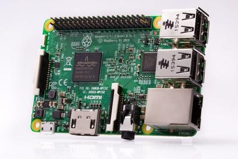
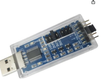
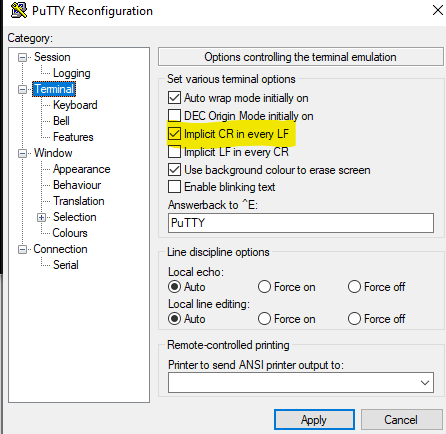
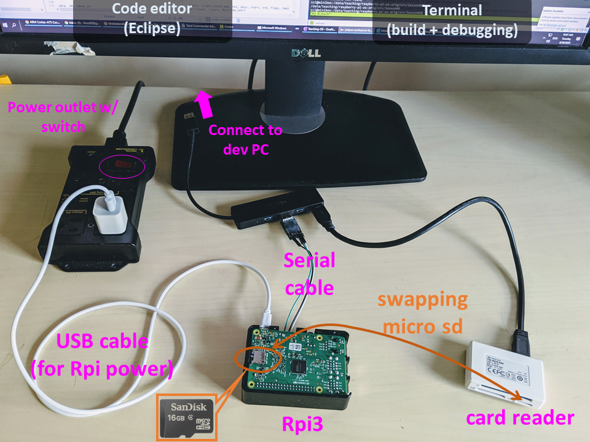
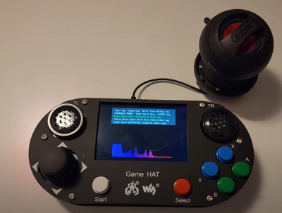
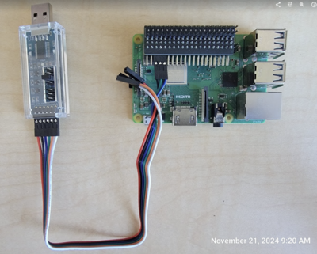
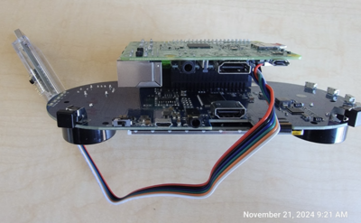
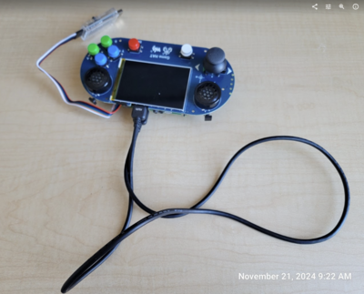

# Setup the raspi3 hardware


## Check list

Students buy:
| Item                                | Provided By | Notes                                                                 |
|-------------------------------------|-------------|-----------------------------------------------------------------------|
| Rpi3 board (Model B or B+)          | Student     | [link](https://www.raspberrypi.org/products/raspberry-pi-3-model-b/)  |


Students check if they have the following items. If not, we will provide them as loaners. 

Hardware-kit pickup spreadsheet [link](https://myuva.sharepoint.com/:x:/s/XSEL-afsara-next/EdYnzYErdZ1AnqmaAjGY2_QBQWsVQ2lCzCud1rGTHytnIQ?e=k0St0w)

| Item                                | Needed for | Notes                                                                 |
|-------------------------------------|-------------|-----------------------------------------------------------------------|
| 1. A USB-UART dongle                    | Lab1 & later  | WSL2 users: SH-V09C5. VM users: legacy & cheap FTDI dongles                                                              |
| 2. A micro SD card (>=16GB)                  | Lab1 & later  |                                                |
| 3. A micro SD card reader that plugs in to personal computers                      | Lab1 & later  |                                                                       |
| 4. A monitor or display that has an HDMI port; & an HDMI cable for it                     | Lab1 & later  | The loaner display comes with an HDMI cable & a USB-C cable. Student may need to provide own USB-C power supply                            |
| 5. A power supply for Rpi3 (Micro USB, at least 5v3A, with inline switch) | Lab1 & later   | Typical 5V1A USB-A port wont work -- no enough power for rpi3                                                            |
| 6. USB keyboard                        | Lab4 & later  |                                                                       |
| 7. Waveshare GAME HAT                         | Lab5+  |                                                             |
| - Battery  (18650 lithium)                      |   | can be charged in place                                                             |
| - HDMI cable                               |   |  for debugging with an external display                                                           |
| - 40pin header extender, angled                    |   |   for debugging by exposing its UART port                                                           |
| - Speaker                                  |   |                                                             |


## Detailed descriptions

### Student provide: An Rpi3 board (Model B or B+) [link](https://www.raspberrypi.org/products/raspberry-pi-3-model-b/)




### We provide the following, based on your needs:

- A USB-serial cable. We use: SH-V09C5



> Some old adapters no longer works for WSL2 (Windows driver issues); however they still works for Linux/VM. 

- A 32GB micro SD card preloaded with firmware

- A SD card reader

- A portable display (inc. HDMI cable and USB-C power supply)

- USB keyboard

- Power supply for Rpi3

- Waveshare GAME HAT (inc. battery; HDMI cable; 40pin header extender; speaker) 


## Prepare for SD card 

Connect the SD card reader to VM. Then in the VM: 
```
cd uva-os-main/make-sd/ 
sudo ./make-sd.sh /dev/sdX
```

Details here: [How to prepare SD cards for experiments](../../make-sd/README-make-sd.md)

## Build and install the kernel 
```
cd uva-os-world1
export PLAT=rpi3
```

| Action              | Command             |
|---------------------|---------------------|
| To clean up         | `./cleanall.sh`     |
| To build everything | `./makeall.sh`      |

If everything builds OK, `kernel/Makefile` should copy the kernel image (kernel8-rpi3.img) to the SD card, in the "bootfs" partition. See `kernel/Makefile` for details.

## Plug in the serial cable

```
Rpi3 <-- a USB-serial cable ---> PC (running a temrinal emulator) 
```

After you get a serial cable, you need to test your connection. If you never did this before I recommend you to follow [this guide](https://cdn-learn.adafruit.com/downloads/pdf/adafruits-raspberry-pi-lesson-5-using-a-console-cable.pdf) It describes the process of connecting your Raspberry PI via a serial cable in great details. Basically, you run Raspberry's official OS to ensure the hardware setup is fine. 


## Configure the serial emulator

### VM/Linux users: see [VMware](../vm/vmware.md)

```
sudo minicom -b 115200 -o -D /dev/ttyUSB0 -C /tmp/minicom.log
```

### WSL2 users: PuTTY recommended. A sample configuration below. 


Change the terminal settings like this:



Note: your PC may give different names to the USB-serial dongle, e.g. COM4. Find it out by looking at Windows Device Manager. 

### Powering up RPi3

Use the provided power supply. You may be attempted to connect Rpi3's power port (micro USB) to your PC's USB port. This is NOT recommended. The power supply from PC's USB port is not enough. 

### An example setup



## GAMEHAT setup

Follow the Waveshare website instructions to assemble it. LEAVE THE back cover off. Plug in the speaker for sound. Insert SD card and power up.



However the UART pins are blocked. To access it for debugging: 

Connect the 40pin header extender to the Rpi3. The connect the serial cable to the extender.



Put Rpi3 back on



Connect the display to the Rpi3 via a HDMI cable (the hard HDMI connector that comes with the gamehat is too short -- not used).




