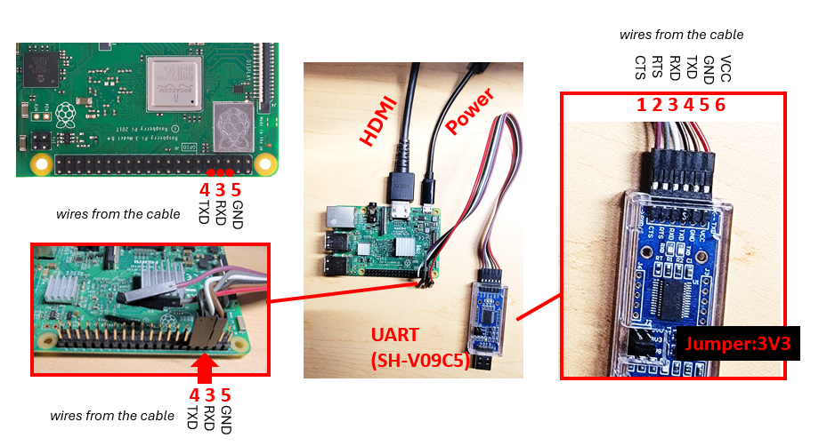

# Setup the raspi3 hardware

## Table of Contents

1. [Check list](#1-check-list)
2. [Prepare SD card](#2-prepare-sd-card)
3. [Connect the UART cable](#3-connect-the-uart-cable)
    1. [The legacy dongle (for VM users; not for WSL2 or native Win10 due to driver issues)](#31-the-legacy-dongle-for-vm-users-not-for-wsl2-or-native-win10-due-to-driver-issues)
    2. [The newer (SH-V09C5) dongle (for WSL2 or VM users)](#32-the-newer-sh-v09c5-dongle-for-wsl2-or-vm-users)
    3. [An example setup of Macbook Pro, which uses USBA-USBC adapter for the UART dongle](#33-an-example-setup-of-macbook-pro-which-uses-usba-usbc-adapter-for-the-uart-dongle)
4. [VM/Linux users: Configure the serial emulator](#4-vmlinux-users-configure-the-serial-emulator)
    1. [Pass through the SD card reader](#41-pass-through-the-sd-card-reader)
    2. [Pass through the USB-UART dongle](#42-pass-through-the-usb-uart-dongle)
    3. [Configure minicom via its config file (already done for VM users)](#43-configure-minicom-via-its-config-file-already-done-for-vm-users)
    4. [Launch minicom](#44-launch-minicom)
5. [WSL2 users: Configure the serial emulator](#5-wsl2-users-configure-the-serial-emulator)
6. [Power up & test](#6-power-up--test)
7. [Build and install your kernel](#7-build-and-install-your-kernel)
8. [GAMEHAT setup](#8-gamehat-setup)
9. [Appendix -- minicom configuration via GUI](#appendix--minicom-configuration-via-gui)
    1. [Minicom serial port settings](#a1-minicom-serial-port-settings)
    2. [Minicom terminal settings](#a2-minicom-terminal-settings)

## 1. Check list

Students buy:
| Item                                | Provided By | Notes                                                                 |
|-------------------------------------|-------------|-----------------------------------------------------------------------|
| Rpi3 board (Model B or B+)          | Student     | [link](https://www.raspberrypi.org/products/raspberry-pi-3-model-b/)  |

Loaner instructions for students:
1. students specify which of the following items are needed. NB: for lab1--3, only item 1--5 are in use.
2. if you need item 1, specify: are you using WSL2 or VM
3. contact: Afsara Benazir (TA) hys4qm@
4. Hardware-kit pickup spreadsheet (mark AFTER the pickup) [link](https://myuva.sharepoint.com/:x:/s/XSEL-afsara-next/EdYnzYErdZ1AnqmaAjGY2_QBQWsVQ2lCzCud1rGTHytnIQ?e=k0St0w)
5. keep any package and cables that come with items (esp item 4 the display), and return the item in its original package. 

| Item                                | Needed for | Notes                                                                 |
|-------------------------------------|-------------|-----------------------------------------------------------------------|
| 1. A USB-UART dongle                    | Lab1 & later  | WSL2 users: SH-V09C5. VM users: legacy FTDI dongles                                                              |
| 2. A micro SD card (>=16GB)                  | Lab1 & later  |                                                |
| 3. A micro SD card reader that plugs in to personal computers                      | Lab1 & later  |   the loaner reader is USB-A, not USB-C. Update: On Mac, built-in SD reader cannot be passed through to VMfusion. Use a USB reader instead. ~~If your laptop lacks USB-A ports (e.g. a recent Macbook Pro), chances are that it has a built-in SD slot already; you just need a cheap microSD-SD adapter (no SD card reader needed) which TAs can provide~~                                  |
| 4. A display w/ HDMI + an HDMI cable                     | Lab1 & later  | The loaner display comes with the needed HDMI-microHDMI cable & USB-C power supply   |
| 5. A power supply for rpi3 (Micro USB, 5v3A, with inline switch) | Lab1 & later   | In a pinch, rpi3 can be powered via a microUSB cable connected to any USB-A port (e.g. from your PC, or any cheap USB charger). That should suffice for lab1/2 which do not draw high power. For later labs, better use 5v3A charger to provide enough power                                                            |
| 6. USB keyboard                        | Lab4 & later  |                                                                       |
| 7. Waveshare GAME HAT                         | Lab5+  |                                                             |
| - Battery  (18650 lithium)                      |   | can be charged in place                                                             |
| - HDMI cable                               |   |  for debugging with an external display                                                           |
| - 40pin header extender, angled                    |   |   for debugging by exposing its UART port                                                           |
| - Speaker                                  |   |                                                             |

## 2. Prepare SD card 

Assume that you have finished setting up VM [here](../vm/vmware.md). 

Connect the SD card reader to VM. Then in the VM: 
```
cd uva-os-main/make-sd/ 
sudo ./make-sd.sh /dev/sdX
```

Details here: [How to prepare SD cards for experiments](../../make-sd/README-make-sd.md)

## 3. Connect the UART cable

```
Rpi3 <-- a USB-serial cable ---> PC (running a terminal emulator) 
```

After you get a serial cable, you need to make the connection. 

### 3.1 The legacy dongle (for VM users; not for WSL2 or native Win10 due to driver issues) 


### 3.2 The newer (SH-V09C5) dongle (for WSL2 or VM users)



### 3.3 An example setup of Macbook Pro, which uses USBA-USBC adapter for the UART dongle. Note that HDMI is yet to be connected. 


## 4. VM/Linux users: Configure the serial emulator

Assume that you have finished setting up VM [here](../vm/vmware.md)

**Notes on pass through USB devices** 

- on some laptops (e.g. Macbook Pro), the built-in SD card readers cannot be passed through to VM. If that happens, use the USB card reader instead. 
- if you have a complex USB topology (e.g. the target USB device connected to a hub, which then connects to a dock, which connects to your computer), the 
VM may not be able to recognize the USB device. 
In that case, directly connect the USB device to a USB port on your computer 
- if your laptop lacks USB-A ports, use a USBA-USBC adapter (often <$2) which the TA should be able to give you one.

### 4.1 Pass through the SD card reader
Often, when you plug in an SD card reader, there's a pop-up asking if you want to connect it to the VM. 
Say yes. 
If not, you can manually connect it.

Example screenshot on Windows (Mac has a similar interface): 


Once passed through, the VM (Ubuntu) should automatically recognize the SD card partitions (check the taskbar on the left), 
and automatically mount the partitions as 
`/media/student/bootfs` and `/media/student/UVA-OS/`

### 4.2 Pass through the USB-UART dongle

In the same way: 


And confirm it: 


On Mac, it's similar:


After that, do `sudo dmesg` from the VM terminal. Look for things like: 


Here, the messages show that the USB-serial adapter is recognized as `/dev/ttyUSB0`.

### 4.3 Configure minicom via its config file (already done for VM users)

create the configure file, if it does not exist
```
sudo gedit /etc/minicom/minirc.dfl
```

And enter the following contents
```
pu port             /dev/ttyUSB0
pu baudrate        115200
pu bits            8
pu parity          N
pu stopbits        1
pu rtscts          No
pu addcarreturn  Yes
```

Save the file. 

### 4.4 Launch minicom

From the VM command line: 
```
sudo minicom -b 115200 -o -D /dev/ttyUSB0 -C /tmp/minicom.log
```

Warning: your OS may give different names to the USB-serial dongle, e.g. /dev/ttyUSB1. Find it out by looking at `dmesg` output above. 

That's it. Continue to rest of the rpi3 setup [../rpi3/rpi3-setup.md](../rpi3/rpi3-setup.md).

```
sudo minicom -b 115200 -o -D /dev/ttyUSB0 -C /tmp/minicom.log
```

## 5. WSL2 users: Configure the serial emulator

PuTTY recommended. A sample configuration below. 


Change the terminal settings like this:


Note: your PC may give different names to the USB-UART dongle, e.g. COM4. Find it out by looking at Windows Device Manager. 

## 6. Power up & test

Use a microUSB power supply rated at 5V3A or higher. 
In a pinch, rpi3 can be powered via a microUSB cable connected to any USB-A port (e.g. from your PC, or any cheap USB charger, often rated 5V1A). That should suffice for lab1/2 which do not draw high power. 
For later labs, better use 5v3A charger to provide enough power. 

If everything works OK, the provided "test" kernel (`make-sd/bootfs/kernel8-rpi3.img`, md5sum 074d1c0bae0a3572bc302d8f3d017a97) will boot and show on the UART: 


To test the display, try `make-sd/bootfs/kernel8-rpi3-display.img` (to use it, rename this file to kernel8-rpi3.img on SD card and reboot rpi3).
it will cycle through four colors on display:

https://github.com/user-attachments/assets/194a12e3-30f1-481e-9378-114059aae0f9

## 7. Build and install your kernel 
```
cd uva-os-world1
export PLAT=rpi3
```

| Action              | Command             |
|---------------------|---------------------|
| To clean up         | `./cleanall.sh`     |
| To build everything | `./makeall.sh`      |

If everything builds OK, `kernel/Makefile` should copy the kernel image (kernel8-rpi3.img) to the SD card, in the "bootfs" partition. See `kernel/Makefile` for details.

## 8. GAMEHAT setup

Follow the Waveshare website instructions to assemble it. LEAVE THE back cover off. Plug in the speaker for sound. Insert SD card and power up.


However the UART pins are blocked. To access it for debugging: 

Connect the 40pin header extender to the Rpi3. The connect the serial cable to the extender.


Put Rpi3 back on


Connect the display to the Rpi3 via a HDMI cable (the hard HDMI connector that comes with the gamehat is too short -- not used).


## Appendix -- minicom configuration via GUI

### A.1 Minicom serial port settings

Press Ctrl-A then O to enter "configuration" 


### A.2 Minicom terminal settings

(Note: T - Add carriage return : Yes) 


[Back to top](#setup-the-raspi3-hardware)