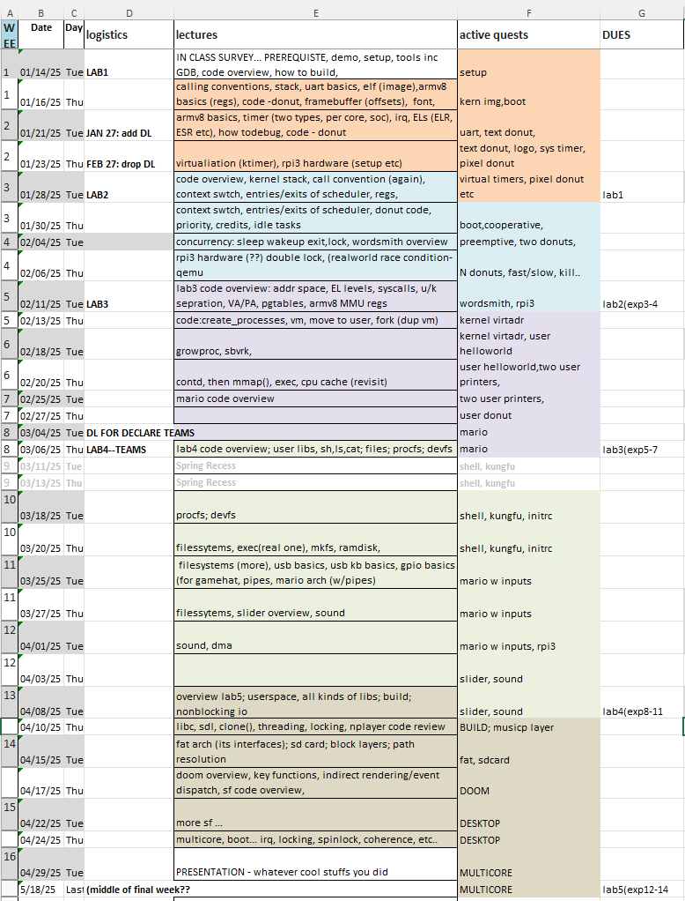

# Operating Systems: From Boot to DOOM

### Syllabus for CS4414/6456 , Spring 2025

Last updated: Jan 2025

**Note: this is a new cs4414**. As the UVA CS department completes the migration to the new undergraduate curriculum, this course has been redesigned accordingly. It is different from my previous offerings of CS4414 (up to Spring 2024), which you can see [here](syllabus-24sp.md).

Special note on doubling counting CS4414/6456: 

- It is OK: if you have taken my CS4414 prior to Spring 2025 and is taking CS6456 in Spring 2025. 
The two courses are different enough. 

- It is NOT OK: if you take my CS4414 as an undergraduate in Spring 2025 and take my CS6456 again in 2026/2027/2028 as a graduate student. 

## Table of Contents

- [SCHEDULE](#schedule)
- [FIRST THINGS FIRST](#first-things-first)
    - [Attitude](#attitude)
    - [Prerequisite](#prerequisite)
    - [Code safety](#code-safety)
- [LOGISTICS](#logistics)
    - [Instruction team](#instruction-team)
    - [Requirements for CS6456 students?](#requirements-for-graduate-students)
    - [Work individually or as teams?](#work-individually-or-as-teams)
    - [Can I use GenAI?](#can-i-use-genai)
    - [Textbook - None](#textbook---none)
- [EQUIPMENT](#equipment)
    - [Emulator or real hardware?](#emulator-or-real-hardware)
    - [Dev machines](#dev-machines)
    - [Rpi3](#rpi3)
- [SUBMISSIONS](#submissions)
- [GRADING](#grading)
    - [How I measure participation](#how-i-measure-participation)
    - [How I determine the final grades](#how-i-determine-the-final-grades)
- [HELP!](#help)
    - [Response time](#response-time)
- [POLICIES](#policies)
    - [Honor](#honor)
    - [Whiteboard only collaboration](#whiteboard-only-collaboration)
    - [Disabilities](#disabilities)
    - [Your wellbeing](#your-wellbeing)
    - [Diversity](#diversity)
    - [Religious accommodations](#religious-accommodations)
    - [Power-based personal violence](#power-based-personal-violence)

## SCHEDULE 

(as of 12/23/24: tentative, subject to change)

## FIRST THINGS FIRST

### Attitude
Read this [FAQ](faq.md) before proceeding. 

### Prerequisite

This course assumes the following prerequisites:

* **CS2130 (CSO1, [sample](https://researcher111.github.io/uva-cso1-F23-DG/)):**
    - C programming
    - Assembly language (some), including converting C to assembly
    - Command line usage, handling arguments
    - Hexadecimal representation, data representation in memory (big/little endian)
    - GDB (or LLDB)
    - Using libc

* **CS3130 (CSO2, [sample](https://www.cs.virginia.edu/~cr4bd/3130/F2024/)):**
    - Concepts: IRQ, virtual memory, cache, CPU, concurrency & synchronization
    - Labs: Makefile usage, shell scripting, process virtual memory observation, demand paging observation
    - Page table manipulation (simulation of multi-level page table)
    - User-level synchronization, TLB toy application (emulated), pthreads, dining philosophers problem
    - Application: "Life" emulation

**Important Note for Incoming Students**

All incoming students should thoroughly understand the above contents. Exemptions may be granted on a case-by-case basis, particularly for graduate students who have not taken UVA undergraduate courses. However, students must be aware of the risks and be prepared to invest a significant amount of time to catch up.

### Do not share your code publicly

Keep your code to yourself; if it is a github repository, make it private. 

This applies to the duration of the semester, and AFTER the semester. 

Making the code public could ruin the experience of future students; it also compromises the instructor's effort on designing the quests. 

PLEASE DO NOT SHARE YOUR CODE PUBLICLY!

### Code safety 

<u>
It is the students' sole responsibility to keep their code safe. 
Accidental loss of code is not an excuse for late submission.
</u> 

**Back up your code regularly**. Like, every hour. 

**Back up to multiple places** including cloud storage your local machines. This is because you may accidentally delete your code, the servers may crash, disks may malfunction, etc. Always assume that the storage is unreliable. 

**Know basic git commands**. Git is prerequisite of this course and modern software development. For instance, when told to do ``git pull'', be prepared to avoid or handle possible local conflicts. Do not blame anyone for conflicts. 

## LOGISTICS

Tue/Thu (01/14/2025 to 04/29/2025) , 12:30 PM - 01:45 PM, OLS 011

Zoom/recordings will be available

### Instruction team

**Instructor**

* Prof. Felix Lin 				xl6yq@virginia.edu

**TAs (tentative)** 

* Wonkyo Choe (PhD student) 			bfr4xr@virginia.edu
* Rongxiang Wang (PhD student) 			waq9hw@virginia.edu
* Dahua Feng (PhD student)

**Office hours (tentative)**

Location: Rice 442

* Mon   11-12p           
* Tue   10-11a
* Thu   1030-1130a (starting from Feb 22nd)
* Thu  330-430p            

* The TAs will: answer questions; give suggestions on your code; offer debugging pointers
* The TAs will not: write or debug your code for you 

### Requirements for CS6456 students? 

This course may be crosslisted as CS6456. 

In addition to a submission per the lab description, a CS6456 student must submit:

- a one-page writeup for each lab sumission, summarizing the key design decisions, challenges, and lessons learned.

The writeup must be submitted as part of the submission. 

The writeup constitutes 10% of the lab grade for CS6456 students. 

### Work individually or as teams?

Lab 1--3 are individual work. Lab 4--5 are team work.

Each team: 2 students. 3-student teams are only approved as exceptions and will be held against a higher bar for grading. 
CS4414 and CS6456 students shall NOT form a team (because they have different grading criteria).

Exceptions to the above rules may be discussed with the instructors. 

### Can I use GenAI? 

Yes, the instructor believes that GenAI (such as ChatGPT and Copilot) is transforming how we write code and freeing us from memorizing low-level hardware/software details. Therefore:

- You are encouraged to use Copilot to generate code snippets. You must clearly state in your submission what information is from Copilot and how it is used.
- Be warned: GenAI can produce code with subtle bugs that are difficult to debug.
- Programming quests: The instructor expects students to use GenAI.
The instructor hence designed these tasks more challenging than traditional ones without GenAI (e.g., writing assembly code for manipulating the stack frame).
- Tooling/scripting tasks: for tasks such as using GDB, diff, and git, the instructor expects students to ask GenAI for help.
ChatGPT is fantastic in explaining how to use these tools.

Therefore, the project descriptions often say "Use AI" to encourage its use. But in general, you can use it in any way you find helpful.

### Textbook - None

There is no official textbook. If you insist on having one:
Operating Systems: Three Easy Pieces, Remzi H. Arpaci-Dusseau and Andrea C. Arpaci-Dusseau 

## EQUIPMENT

## Emulator or real hardware? 

All the code can run on both the emulator (QEMU) and real hardware (Raspberry Pi 3, or rpi3).

The expectation is that students will start with the emulator and gradually migrate to testing their code on both the emulator and real hardware.

Students shall buy rpi3 ($35) at own expense. The instructor will provide all other needed accessories, on a need basis.

Assignments early in the semester can be done with full credits using QEMU. 
Assignments later in the semester can be done with QEMU for partial credits, and with rpi3 for full credits.

### Dev machines 

Use your own computers. 
Windows/Linux is preferred as they are our test platforms; Mac also work but may have technical issues. 
The instruction team is committted to support Mac.
You can get a loaner Windows laptop from the CS IT, if needed. 

### Rpi3

If you choose to do the assignments on real hardware, you will need a Raspberry Pi 3. You must buy it yourself with $35. 

We will provide all other needed accessories, on a need basis: 
- UART cable for debugging
- SD card and reader
- External display and HDMI cable
- Power supply
- USB keyboard
- Waveshare Game HAT for rpi3

## SUBMISSIONS

Submissions are done via the UVA LMS. Submission will be closed after the deadline. 

**Repeated submissions.** Before the deadline, submit as many times as you like. Earlier submissions will be overwritten. 

Sumit often; submit early. 

**Late submissions.** Once the submission deadline has passed: do NOT try to submit; do NOT email the instructor or the TAs. 
Such emails will be automatically ignored. All submissions are due **at 5pm**. **NOT the midnight**. 

<!----
**Use of diff files**. Some submissions may ask you to submit a diff file, which may be generated by the "diff" or "git-diff" commands (detailed instructions will be provided). 

* The point of submitting a diff file -- allows the TAs to quickly spot what you have done
* A diff file is a textual file, which is supposed to contain all code changes made by you. Please always manually inspect the diff file prior to submission. 
* If your diff file is super large (>100KB), it is likely because of the line ending issue: the diff file mistakenly includes conceptually identical lines that only differ in line ending characters (CRLF vs LF). Please do submit such a large diff file. Fix the problem. You can easily find solution via Piazza, Google, or ChatGPT. 
* Do not wait until the last minute to learn diff and git-diff, which may surprise you.   
* If you fear that git-diff (and any other git commands) will mess up your local code, you can always make a copy of the whole project directory and run the git commands on that copy
--->

**Submission instructions.**

https://github.com/fxlin/uva-os-world1/blob/student/docs/submission.md

## GRADING 

| Component       | Percentage |
|-----------------|-------------|
| Lab 1           | 10%         |
| Lab 2           | 15%         |
| Lab 3           | 20%         |
| Lab 4           | 25%         |
| Lab 5           | 25%         |
| Participation   | 5%          |
| **Total**       | **100%**    |

### How I measure participation
The factors we consider include, but not limited to the following: 
•	Classroom attendance 
•	OH attendance (with TAs or instructor)
•	Online discussion 
We expect a student to participate in some of the above activities (not necessarily all). 

**Do NOT ask for our formula** on how we calculate the participation points – as it is difficult to figure out one to cover all the above factors. You will need to trust that the instructor will give fair participation points. If you disagree with your participation points after the grade is out, talk to the instructor. 

### How I determine the final grades 

https://fxlin.github.io/final-grades.pdf

## HELP!

Use Piazza linked in the Canvas page. 

### Response time 

**The instruction team is committed to response Piazza questions:** 

* During business hours (8a-5p): < 2 hours

* Out of business hours, on days when UVA is open: next day
* Weekends, UVA holidays: no guarantee, with best efforts

The response time is independent of any upcoming deadline. 

**Note:** Raise questions well before the deadlines. Do NOT expect a faster response just because it's right before the deadline. 

## POLICIES

### Honor 

I trust every student in this course to fully comply with all of the provisions of the University’s Honor Code. By enrolling in this course, you have agreed to abide by and uphold the Honor System of the University of Virginia. 

### Whiteboard only collaboration 

is meant to convey the type of discussion where participants gather around a whiteboard to solve a problem together, without taking any notes from their discussion, and then erasing the whiteboard before they disperse.

In particular, you may discuss problems and solutions, but the only thing you may take away from your discussion is your brain. This means you may not produce any records or artifacts from your collaborations, including: notes, screenshots, photos, figures, audio/video recordings, documents (inluding google docs), links, or any other digital or tangible thing. Nor may you share any files, links, etc. with other students outside of a collaboration session. Any substantially similar expression of the same solution can only occur if collaboration extends beyond whiteboard only, and so will be considered as evidence of a policy violation.

In your submission, please clearly state the students you had discussion with. 

*(adopted from policy by Dr. Nathan Brunelle for DSA2, under CC-BY-NC-SA 4.0)*

### Disabilities 

The University of Virginia strives to provide accessibility to all students. If you require an accommodation to fully access this course, please contact the Student Disability Access Center (SDAC) at (434) 243-5180 or [sdac@virginia.edu](mailto:sdac@virginia.edu). If you are unsure if you require an accommodation, or to learn more about their services, you may contact the SDAC at the number above or by visiting their website at http://studenthealth.virginia.edu/student-disability-access-center/faculty-staff. 

### Your wellbeing 

The Computer Science Department and SEAS aims to promote their students’ wellbeing. If you are feeling overwhelmed, stressed, or isolated, there are many individuals here who are ready and wanting to help. If you wish, you can make an appointment with me and come to my office to talk in private. 

Alternatively, there are also other University of Virginia resources available. The Student Health Center offers Counseling and Psychological Services (CAPS) for its students. Call 434-243-5150 or 434-972-7004 for after hours and weekend crisis assistance) to get started and schedule an appointment. If you prefer to speak anonymously and confidentially over the phone, call Madison House’s HELP Line at any hour of any day: 434-295-8255. 

If you or someone you know is struggling with gender, sexual, or domestic violence, there are many community and University of Virginia resources available. The Office of the Dean of Students, Sexual Assault Resource Agency (SARA), Shelter for Help in Emergency (SHE), and UVA Women’s Center are ready and eager to help. Contact the Director of Sexual and Domestic Violence Services at 434-982-2774. 

### Diversity 

It is the instructors’ intent that students from all diverse backgrounds and perspectives be well served by this course, that students’ learning needs be addressed both in and out of class, and that the diversity that students bring to this class be viewed as a resource, strength and benefit. It is my intent to present materials and activities that are respectful of diversity: gender, sexuality, disability, age, socioeconomic status, ethnicity, race, and culture. Your suggestions are encouraged and appreciated. Please let me know ways to improve the effectiveness of the course for you personally or for other students or student groups. 

### Religious accommodations 

It is the University’s long-standing policy and practice to reasonably accommodate students so that they do not experience an adverse academic consequence when sincerely held religious beliefs or observances conflict with academic requirements. Students who wish to request academic accommodation for a religious observance should submit their request in writing directly to me by email as far in advance as possible. Students and instructors who have questions or concerns about academic accommodations for religious observance or religious beliefs may contact the University’s Office for Equal Opportunity and Civil Rights (EOCR) at [UVAEOCR@virginia.edu](mailto:UVAEOCR@virginia.edu) or 434-924-3200. Accommodations do not relieve you of the responsibility for completion of any part of the coursework missed as the result of a religious observance. 

### Power-based personal violence 

The University of Virginia is dedicated to providing a safe and equitable learning environment for all students. To that end, it is vital that you know two values that I and the University hold as critically important: 

1. Power-based personal violence will not be tolerated. 
2. Everyone has a responsibility to do their part to maintain a safe community on Grounds. 

If you or someone you know has been affected by power-based personal violence, more information can be found on the UVA Sexual Violence website that describes reporting options and resources available - [www.virginia.edu/sexualviolence](http://www.virginia.edu/sexualviolence). 

As your professor and as a person, know that I care about you and your well-being and stand ready to provide support and resources as I can. As a faculty member, I am a responsible employee, which means that I am required by University policy and federal law to report what you tell me to the University's Title IX Coordinator. The Title IX Coordinator's job is to ensure that the reporting student receives the resources and support that they need, while also reviewing the information presented to determine whether further action is necessary to ensure survivor safety and the safety of the University community. If you would rather keep this information confidential, there are Confidential Employees you can talk to on Grounds (See http://www.virginia.edu/justreportit/confidential_resources.pdf). The worst possible situation would be for you or your friend to remain silent when there are so many here willing and able to help. 
